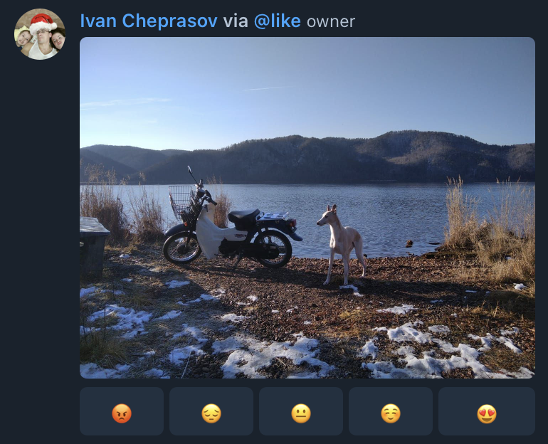

# esthetique-telegram-bot
A telegram chatbot that periodically gives **statistics** on posted via **tg @like bot messages**, i.e. esthetique posts, 
and can warn you about **image duplicating**.


# Agenda
* [Definition](#definition)
* [Feature](#feature)
* [Start](#start)
   * [Briefly](#briefly)
   * [With Cache Warming Up](#with-cache-warming-up)
* [Settings](#settings)
* [Develop](#develop)
   * [Develop docker-compose](#develop-docker-compose)
   * [Contribution](#contribution)
* [TODO](#todo)
* [Acknowledgement](#acknowledgement)

## Definition
- tg-@like bot message/esthetique post: message with photo that sent with help of tg-@like bot 
with 5 buttons: 😡 / 😔 / 😐 / ☺️ / 😍 to the chat
- statistics: bot shows images with [best score](bot/src/utils/calculations.py) in ascending order

<details>
  <summary>Esthetique example</summary>

  

</details>

## Feature
- statistics: it is not possible via standard tg bot features to obtain changed historic information of an 
already collected message, thus, [telethon](https://github.com/LonamiWebs/Telethon) is here in [chat_history](./chat_history) FastAPI microservice.
- image duplicating: I use [ImageHash](https://pypi.org/project/ImageHash/) lib as it is in [bot](./bot/src/utils/serializers.py). 
In realtime [aiogram](https://github.com/aiogram/aiogram) bot handle esthetique posts and duplication warnings.

## Start

### Briefly
Before I suppose that both bots: telethon ([chat_history](chat_history)) bot and aiogram ([bot](bot)) added to chat. 

There is [docker-compose file](deploy/docker-compose.prod.yml) presented, 
thus, to run:
- go to [deploy/](deploy) and prepare your `.env`  according to [deploy/.env.example](deploy/.env.example),
than to start compose in daemon mode:
```bash
docker-compose -f docker-compose.prod.yml up -d
```
- for telethon you should login with pin verified, for this purpose I left [script](./chat_history/src/scripts/init_session.py), So, e.g.:
```bash
docker exec -ti deploy_chat_history_1 sh -c "python scripts/init_session.py" 
```
and complete login.

> todo: make this login as entrypoint with bot forward message with  verification to admin

### With Cache Warming Up 
When you want to populate image hashes with already existing chat and its history 
I left a [not good script](scripts/import_previos_images_hashes.py) for 1 run. 
The script is also may replace [script](./chat_history/src/scripts/init_session.py) mentioned earlier coz it creates session for telethon in redis as well.

Before to continue I suppose:
- Chat already exists. To be more precisely, chat is in supergroup status
- Chat history for new members is visible
- telethon bot account and aiogram bot account added to chat
- requirements for both installed in python3.9
- redis has port allocated to host, `deploy/.env` has values according, i.e. `REDIS_HOST=localhost`

To start import run from [script](script) directory:
```bash
python import_previous_images_hashes.py
```

> todo: too complicated instruction, instead prepare one run dockerfile instead of script? 
> or even make use for chat_history image api?

## Settings
Settings that may be tunes should be located in `deploy/.env` and prepared as in [deploy/.env.example](deploy/.env.example).

> To find chat_id fast: https://api.telegram.org/bot<UR_BOT_TOKEN>/getUpdates

## Develop
### Develop docker-compose

<details>
    <summary>E.g.</summary>

    ```yaml
    version: '3.8'
    
    volumes:
      redis_data_dev:
    
    x-app: &dev-app
      env_file:
        - ./.env
      depends_on:
        - redis
    
    services:
      chat_history:
        <<: *dev-app
        build:
          context: ../chat_history
          dockerfile: .
        command: uvicorn main:app --reload --host 0.0.0.0 --port 8000
        volumes:
          - ../chat_history/src/:/opt/
        ports:
          - 8000:8000
    
      bot:
        <<: *dev-app
        build:
          context: ../bot
          dockerfile: .
        volumes:
          - ../bot/src/:/opt/
    
      redis:
        image: redis:6.0.8-alpine
        volumes:
          - redis_data_dev:/data
        ports:
          - 6379:6379
      ```

</details>


### Contribution
- pep8, pls [120 symbols per line]

## TODO
- [ ] github compose deploy
- [ ] check that we calculate only chat members votes
- [ ] in-code todos about entrypoint
- [ ] in-code todos about chat_history app (telethon ) verification asking
- [ ] auto title image change 

## Acknowledgement
- Bot structure is a bit according to https://github.com/Arwichok/asyncbot
- ImageHash lib used coz of "recent" usage by @sergmiller in prev. project
